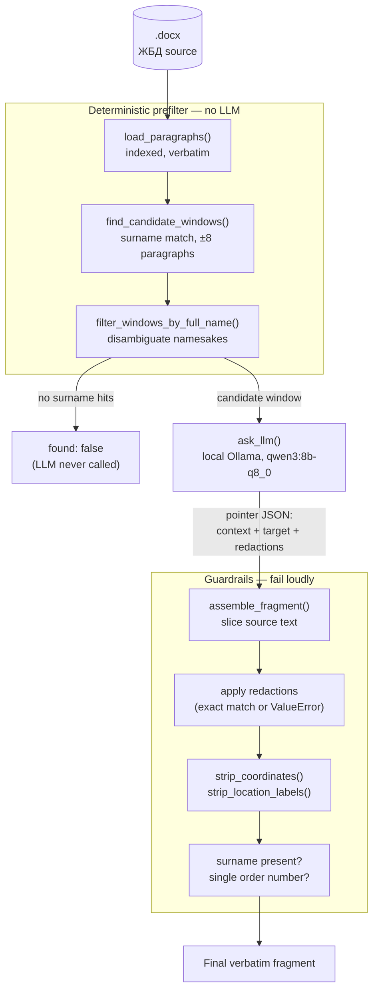

# ЖБД Extract Generator

A pipeline that generates official "витяг" (extract) documents from ЖБД
(Ukrainian military combat log) records for a specific serviceman over a
date range, sourced from per-day `.docx` files.

Source documents carry a "ДСК" (restricted/internal-use) classification.
**Everything runs fully local/offline — no cloud LLM calls, no telemetry.**

## Core principle

The output text must be **100% verbatim** from the source ЖБД — zero
paraphrasing, zero rewriting. To guarantee this structurally rather than by
hoping the model behaves, the LLM never writes the final text. It only
returns *pointers* into a numbered paragraph list (which paragraphs to
include, which one has the target person, what to redact if someone else
shares their paragraph). All text assembly is deterministic Python code
that slices the original source characters — the LLM has no channel through
which it could introduce wording drift.

The only edits ever applied to the source text are: paragraph selection,
removing another person's text sharing the target's paragraph, a trailing
`;` → `.` fix, and unconditional stripping of MGRS grid coordinates and
"район зосередження" location phrases (tactical data with no place in a
personnel extract). See `CLAUDE.md` for the full rule set and rationale.

## Architecture

`load_paragraphs()` parses a day's `.docx` into an indexed, verbatim
paragraph list. A deterministic surname/full-name prefilter narrows this
down to a small candidate window *before* the LLM ever sees it — this is
what prevents namesakes governed by different orders from being mixed
together, and lets the LLM call be skipped entirely when the person isn't
in that day at all. `ask_llm()` sends only that narrow window to a local
Ollama model and gets back a pointer (never prose). `assemble_fragment()`
slices the original text per the pointer, applies exact-match redactions,
runs guardrails (surname must be present, context must not span two
different order numbers), strips coordinates/location labels, and applies
the one allowed punctuation fix.



## Pipeline status

Implemented today (`test_vytyah_extraction.py`): single-day, single-person
extraction with the full prefilter → LLM → assemble → guardrail flow above.

Not yet built: cross-day merging into date ranges, a batch driver over a
folder of daily files, rendering into the actual вityah `.docx` template,
and a tracked accuracy benchmark. See `CLAUDE.md` for details.

## Setup

**1. Install Ollama**

```bash
# Linux
curl -fsSL https://ollama.com/install.sh | sh
```
On Windows, download the installer from `ollama.com/download`.

**2. Pull the model**

```bash
ollama pull qwen3:8b-q8_0
```

`qwen3:8b-q8_0` (Apache 2.0, ~8.7GB) was chosen deliberately: strong
multilingual/Ukrainian support, and Q8_0 over the default Q4_K_M because
this workload is prefill-bound (short JSON output, longer prompt), where
Q8_0's precision advantage isn't offset by Q4_K's dequant overhead — measured,
not assumed. See `CLAUDE.md` → "LLM configuration" for the full reasoning
and other model options if 8B proves too slow or inaccurate.

**3. Install Python dependencies**

```bash
pip install python-docx requests --break-system-packages
```

**4. Provide a source file**

Place a daily `.docx` ЖБД file in the `journals/` folder (or point
`ZHBD_PATH` in `test_vytyah_extraction.py` at it). Sample вityah documents
go in `samples/`. Both `journals/` and `samples/` are gitignored — the
source and sample content is ДСК-classified and must never be committed.

## Running

```bash
python3 test_vytyah_extraction.py
```

Edit the `test_cases` list in the script to real names known to be present
in your source file. The script prints, per person: the prefilter window
size, the LLM's raw pointer response, and the final assembled fragment (or
a `found: false` / guardrail rejection).

Target dev hardware: AMD Ryzen 7 7840HS, 32GB RAM, CPU-only inference. A
few seconds per query is acceptable — this is batch/offline processing,
not real-time.

## Further reading

`CLAUDE.md` has the full project context: the complete edit-rule list, the
pointer JSON schema, all non-obvious LLM configuration settings (especially
`"think": false`, which fixes a several-fold latency bug), the empirical
bug log behind each guardrail, and known test data/people for regression
testing.
