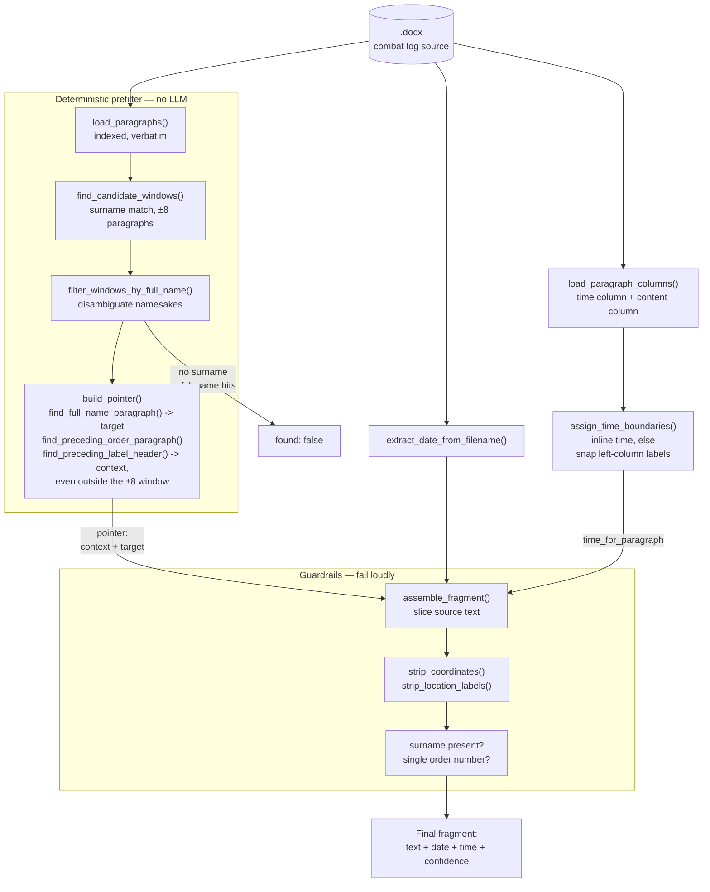

# Combat Log Extract Generator

A pipeline that generates official "витяг" (extract) documents from combat
log records for a specific serviceman over a date range, sourced from
per-day `.docx` files.

Source documents carry a restricted (internal-use) classification.
**Everything runs fully local/offline — no cloud LLM calls, no telemetry,
no LLM of any kind.**

## Core principle

The output text must be **100% verbatim** from the source combat log — zero
paraphrasing, zero rewriting. There is no text-generation model anywhere in
this pipeline: locating a person's mention resolves to *pointers* into a
numbered paragraph list (which paragraphs to include as context, which one
has the target person), computed entirely by deterministic string/regex
logic. All text assembly is deterministic Python code that slices the
original source characters, so there is no channel through which wording
drift could ever be introduced.

The only edits ever applied to the source text are: paragraph selection, a
trailing `;` → `.` fix, and unconditional stripping of MGRS grid
coordinates and "район зосередження" location phrases (tactical data with
no place in a personnel extract). Other people's text sharing the target's
paragraph is left in place, untouched. See `CLAUDE.md` for the full rule
set and rationale.

## Architecture

`load_paragraphs()` parses a day's `.docx` into an indexed, verbatim
paragraph list. A deterministic surname/full-name prefilter narrows this
down to the single candidate window that contains the person's full name
verbatim — this is what prevents namesakes governed by different orders
from ever being mixed together, and lets the whole lookup be skipped when
the person isn't in that day at all. `build_pointer()` (`prefilter.py`)
then resolves the final pointer: `find_full_name_paragraph()` locates the
target paragraph, and `find_preceding_order_paragraph()` +
`find_preceding_label_header()` walk backward from it to locate the
governing order and any immediate call-sign/position header — which can
sit outside the ±8 window (e.g. one order heading a long list of many
groups) — see `CLAUDE.md` bug log for the real cases that shaped this
walk-back logic. `assemble_fragment()` slices the original text per the
pointer, runs guardrails (surname must be present, context must not span
two different order numbers), strips coordinates/location labels, applies
the one allowed punctuation fix, and attaches date/time metadata. The date
comes from the filename (`extract_date_from_filename()`); the time comes
from `assign_time_boundaries()` + `time_for_paragraph()`, which first look
for the exact inline time format and only fall back to a heuristic over
the source table's (non-paragraph-aligned) left time column
(`load_paragraph_columns()`) when no inline time is present — see
`CLAUDE.md` → "Time-of-day extraction" for why the left-column case can't
be an exact lookup, and how uncertain results are flagged rather than
guessed.



## Pipeline status

Implemented today (`run_demo.py`, plus `config.py` / `docx_parsing.py` /
`prefilter.py` / `time_extraction.py` / `assembly.py`): single-day,
single-person extraction with the full prefilter → pointer resolution →
assemble → guardrail flow above, plus date (from filename, any of
`_`/`.`/`-` separators) and time-of-day metadata attached to each result —
exact when the source uses the inline time format, heuristic (flagged when
uncertain) when it uses the left-column format.

Not yet built: cross-day merging into date ranges, a batch driver over a
folder of daily files, rendering into the actual extract `.docx` template,
and a tracked accuracy benchmark. See `CLAUDE.md` for details.

**No actual extract `.docx` file is produced yet.** `run_demo.py` only
prints the assembled fragment (text + date + time) to the console — there
is no code that writes a `.docx` matching the real extract template's
header/table/signature-block layout. Producing that output file is still
open work.

## Setup

**1. Install Python dependencies**

```bash
pip install python-docx --break-system-packages
```

**2. Provide source files**

Place daily `.docx` combat log files in the `journals/` folder (or point
`COMBAT_LOG_DIR` in `config.py` at a different directory). The script picks
up every `.docx` file it finds there, sorted chronologically by the date
encoded in each filename. Sample extract documents go in `samples/`. Both
`journals/` and `samples/` are gitignored — the source and sample content
carries a restricted classification and must never be committed.

## Running

```bash
python3 src/run_demo.py
```

Edit the `test_cases` list in the script to real names known to be present
in your source files. The script runs every `.docx` file in `journals/` in
chronological order and, per file per person, prints: the narrowing note,
the resolved pointer, and the final assembled fragment with its date and
heuristically-resolved time (or a `found: false` / guardrail rejection). A
time flagged `uncertain` is printed with an explicit warning — never
presented as fact without review.

This runs each day independently — it does not yet merge consecutive days
into a single "з ... по ..." range, filter to a requested date range, or
flag genuinely-absent dates as gaps (see `CLAUDE.md` → "Not yet built").

Everything here is regex/string logic over an already-parsed paragraph
list, so it runs in well under a second per person/day — no particular
hardware requirements.

## Further reading

`CLAUDE.md` has the full project context: the complete edit-rule list, the
pointer schema, the empirical bug log behind each guardrail and finder
function (including the earlier LLM-based version of this pipeline that
motivated them), and known test data/people for regression testing.
