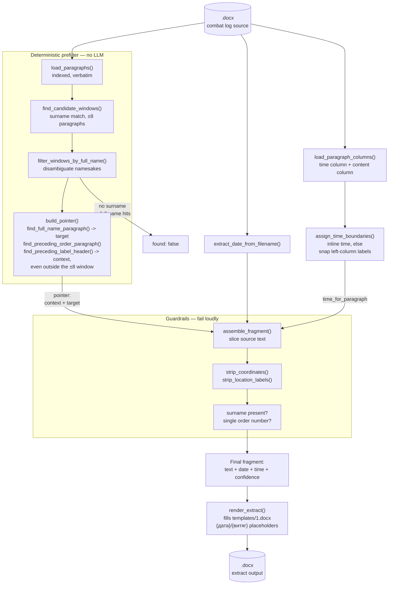

# Combat Log Extract Generator

A pipeline that generates official "витяг" (extract) documents from combat
log records for a specific serviceman over a date range, sourced from
per-day `.docx` files.

Source documents carry a restricted (internal-use) classification.
**Everything runs fully local/offline — no cloud LLM calls, no telemetry,
no LLM of any kind.**

## Core principle

The output text must be **100% verbatim** from the source combat log — zero
paraphrasing, zero rewriting. There is no text-generation model anywhere in
this pipeline: locating a person's mention resolves to *pointers* into a
numbered paragraph list (which paragraphs to include as context, which one
has the target person), computed entirely by deterministic string/regex
logic. All text assembly is deterministic Python code that slices the
original source characters, so there is no channel through which wording
drift could ever be introduced.

The only edits ever applied to the source text are: paragraph selection, a
trailing `;` → `.` fix, and unconditional stripping of MGRS grid
coordinates and "район зосередження" location phrases (tactical data with
no place in a personnel extract). Other people's text sharing the target's
paragraph is left in place, untouched. See `CLAUDE.md` for the full rule
set and rationale.

## Architecture

`load_paragraphs()` parses a day's `.docx` into an indexed, verbatim
paragraph list. A deterministic surname/full-name prefilter narrows this
down to the single candidate window that contains the person's full name
verbatim — this is what prevents namesakes governed by different orders
from ever being mixed together, and lets the whole lookup be skipped when
the person isn't in that day at all. `build_pointer()` (`prefilter.py`)
then resolves the final pointer: `find_full_name_paragraph()` locates the
target paragraph, and `find_preceding_order_paragraph()` +
`find_preceding_label_header()` walk backward from it to locate the
governing order and any immediate call-sign/position header — which can
sit outside the ±8 window (e.g. one order heading a long list of many
groups) — see `CLAUDE.md` bug log for the real cases that shaped this
walk-back logic. `assemble_fragment()` slices the original text per the
pointer, runs guardrails (surname must be present, context must not span
two different order numbers), strips coordinates/location labels, applies
the one allowed punctuation fix, and attaches date/time metadata. The date
comes from the filename (`extract_date_from_filename()`); the time comes
from `assign_time_boundaries()` + `time_for_paragraph()`, which first look
for the exact inline time format and only fall back to a heuristic over
the source table's (non-paragraph-aligned) left time column
(`load_paragraph_columns()`) when no inline time is present — see
`CLAUDE.md` → "Time-of-day extraction" for why the left-column case can't
be an exact lookup, and how uncertain results are flagged rather than
guessed. `pipeline.py`'s `resolve_day_fragment()` wraps the whole
prefilter → pointer → assemble chain into one call (used by
`generate_extract.py`, so the not-found/ambiguous/guardrail branching
only lives in one place). `render.py`'s
`render_extract()` then fills `templates/1.docx`'s `{дата витягу}` /
`{дата}` / `{витяг}` placeholders with a person's assembled fragments —
every value it writes came verbatim out of `assemble_fragment()`, so
rendering never introduces a text-generation step.



## Pipeline status

Implemented today (`config.py` / `docx_parsing.py` / `prefilter.py` /
`time_extraction.py` / `assembly.py` / `pipeline.py`): single-day,
single-person extraction with the full prefilter → pointer resolution →
assemble → guardrail flow above, plus date (from filename, any of
`_`/`.`/`-` separators) and time-of-day metadata attached to each result —
exact when the source uses the inline time format, heuristic (flagged when
uncertain) when it uses the left-column format. `merge.py` collapses
consecutive "found" days with byte-identical text into a single
"з ... по ..." range. `render.py` + `generate_extract.py` render the
result into a real extract `.docx` per person, filling `templates/1.docx`.

Not yet built: a tracked accuracy benchmark. See `CLAUDE.md` for details.

## Setup

**1. Install Python dependencies**

```bash
pip install python-docx pillow --break-system-packages
```

(Pillow is used only to measure real glyph widths from the bundled
`assets/fonts/Carlito-Regular.ttf`, so `render.py` can compute how many
visual lines a paragraph wraps to and keep the `{дата}` column aligned with
`{витяг}` — see `text_wrap.py`.)

**2. Provide source files**

Place daily `.docx` combat log files in the `journals/` folder (or point
`COMBAT_LOG_DIR` in `config.py` at a different directory). The scripts pick
up every `.docx` file found there, sorted chronologically by the date
encoded in each filename. Sample extract documents go in `samples/`; the
extract template goes in `templates/` (`TEMPLATE_PATH` in `config.py`).
`journals/` and `samples/` are gitignored — the source and sample content
carries a restricted classification and must never be committed (as is
every `*.docx` file anywhere in the repo, including generated output).

## Running

**Generate a real extract `.docx`** — one file per person, filling
`templates/1.docx` — via `run.sh`, which just forwards its arguments to
`src/generate_extract.py`. Names to extract can be passed either as
inline arguments or as a path to a newline-delimited `.txt` file:

```bash
./run.sh "молодший сержант КОТИК Андрій Сергійович"
./run.sh "молодший сержант КОТИК Андрій Сергійович" "солдат ТУЗ І.В."
./run.sh ./names.txt
./run.sh "старший солдат ЛЕВИЦЬКИЙ Микита Петрович 02.04.2026"
./run.sh "старший солдат ЛЕВИЦЬКИЙ Микита Петрович 02.04.2026-23.04.2026"
```

Each name must be a full `"rank SURNAME Firstname Patronymic"` string
(surname in caps), the same shape `prefilter.py`'s narrowing expects,
optionally followed by a requested `DD.MM.YYYY` date or
`DD.MM.YYYY-DD.MM.YYYY` inclusive range (`person_spec.py`) that limits the
search to those day(s) instead of every file in `journals/`. A `.txt`
file is detected automatically whenever exactly one argument is given and
it's an existing file path — one name (with its own optional date/range)
per line, blank lines skipped. Running `./run.sh` with no arguments
prints a usage message and exits without doing anything; there is no
fallback placeholder-name list anymore, so real names always have to be
supplied explicitly (and never committed — keep any local names file out
of version control yourself).

For each person, the script walks every `.docx` file in `journals/`
chronologically (or just the requested date range, if one was given) via
`resolve_day_fragment()`, collects the days that resolve to `found`,
prints a warning for any day that doesn't (never silently dropped), and —
if at least one day was found — writes
`output/Витяг_<ПРІЗВИЩЕ>_<issue date>.docx` (`OUTPUT_DIR` in `config.py`;
also gitignored). When a date range is requested, any date in it with no
matching `.docx` file is flagged as an explicit gap, distinct from a day
that has a file but doesn't mention the person. The header's issuance
date defaults to today; a stacked entry shows its own date + time when
it's a single unmerged day, or a "з ... по ..." range (no time) when
`merge.py` has collapsed a run of consecutive days with byte-identical
text — uncertain/unresolved times are flagged inline in the document text
itself rather than hidden.

Everything here is regex/string logic over an already-parsed paragraph
list, so it runs in well under a second per person/day — no particular
hardware requirements.

## Further reading

`CLAUDE.md` has the full project context: the complete edit-rule list, the
pointer schema, the empirical bug log behind each guardrail and finder
function (including the earlier LLM-based version of this pipeline that
motivated them), and known test data/people for regression testing.
