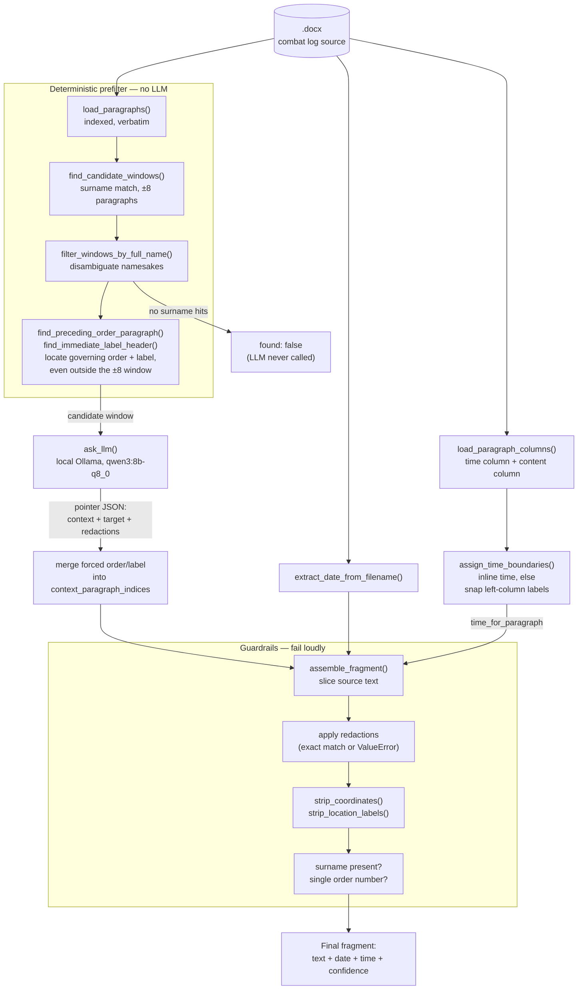

# Combat Log Extract Generator

A pipeline that generates official "витяг" (extract) documents from combat
log records for a specific serviceman over a date range, sourced from
per-day `.docx` files.

Source documents carry a restricted (internal-use) classification.
**Everything runs fully local/offline — no cloud LLM calls, no telemetry.**

## Core principle

The output text must be **100% verbatim** from the source combat log — zero
paraphrasing, zero rewriting. To guarantee this structurally rather than by
hoping the model behaves, the LLM never writes the final text. It only
returns *pointers* into a numbered paragraph list (which paragraphs to
include, which one has the target person, what to redact if someone else
shares their paragraph). All text assembly is deterministic Python code
that slices the original source characters — the LLM has no channel through
which it could introduce wording drift.

The only edits ever applied to the source text are: paragraph selection,
removing another person's text sharing the target's paragraph, a trailing
`;` → `.` fix, and unconditional stripping of MGRS grid coordinates and
"район зосередження" location phrases (tactical data with no place in a
personnel extract). See `CLAUDE.md` for the full rule set and rationale.

## Architecture

`load_paragraphs()` parses a day's `.docx` into an indexed, verbatim
paragraph list. A deterministic surname/full-name prefilter narrows this
down to a small candidate window *before* the LLM ever sees it — this is
what prevents namesakes governed by different orders from being mixed
together, and lets the LLM call be skipped entirely when the person isn't
in that day at all. Before the LLM call, `find_preceding_order_paragraph()`
and `find_immediate_label_header()` also walk backward from the target to
locate the governing order and any immediate call-sign/position header —
which can sit outside the ±8 window (e.g. one order heading a long list of
many groups) — and force them into the final context regardless of what
the LLM selects, since testing showed the model can drop them even when
they're already visible (see `CLAUDE.md` bug log). `ask_llm()` sends the
candidate window to a local Ollama model and gets back a pointer (never
prose). `assemble_fragment()` slices the original text per the (merged)
pointer, applies exact-match redactions,
runs guardrails (surname must be present, context must not span two
different order numbers), strips coordinates/location labels, applies the
one allowed punctuation fix, and attaches date/time metadata. The date
comes from the filename (`extract_date_from_filename()`); the time comes
from `assign_time_boundaries()` + `time_for_paragraph()`, which first look
for the exact inline time format and only fall back to a heuristic over
the source table's (non-paragraph-aligned) left time column
(`load_paragraph_columns()`) when no inline time is present — see
`CLAUDE.md` → "Time-of-day extraction" for why the left-column case can't
be an exact lookup, and how uncertain results are flagged rather than
guessed.



## Pipeline status

Implemented today (`run_demo.py`, plus `config.py` / `docx_parsing.py` /
`prefilter.py` / `llm_client.py` / `time_extraction.py` / `assembly.py`):
single-day, single-person extraction with the full prefilter → LLM →
assemble → guardrail flow above, plus date (from filename, any of
`_`/`.`/`-` separators) and time-of-day metadata attached to each result —
exact when the source uses the inline time format, heuristic (flagged when
uncertain) when it uses the left-column format.

Not yet built: cross-day merging into date ranges, a batch driver over a
folder of daily files, rendering into the actual extract `.docx` template,
and a tracked accuracy benchmark. See `CLAUDE.md` for details.

**No actual extract `.docx` file is produced yet.** `run_demo.py` only
prints the assembled fragment (text + date + time) to the console — there
is no code that writes a `.docx` matching the real extract template's
header/table/signature-block layout. Producing that output file is still
open work.

## Setup

**1. Install Ollama**

```bash
# Linux
curl -fsSL https://ollama.com/install.sh | sh
```
On Windows, download the installer from `ollama.com/download`.

**2. Pull the model**

```bash
ollama pull qwen3:8b-q8_0
```

`qwen3:8b-q8_0` (Apache 2.0, ~8.7GB) was chosen deliberately: strong
multilingual/Ukrainian support, and Q8_0 over the default Q4_K_M because
this workload is prefill-bound (short JSON output, longer prompt), where
Q8_0's precision advantage isn't offset by Q4_K's dequant overhead — measured,
not assumed. See `CLAUDE.md` → "LLM configuration" for the full reasoning
and other model options if 8B proves too slow or inaccurate.

**3. Install Python dependencies**

```bash
pip install python-docx requests --break-system-packages
```

**4. Provide source files**

Place daily `.docx` combat log files in the `journals/` folder (or point
`COMBAT_LOG_DIR` in `config.py` at a different directory). The script picks
up every `.docx` file it finds there, sorted chronologically by the date
encoded in each filename. Sample extract documents go in `samples/`. Both
`journals/` and `samples/` are gitignored — the source and sample content
carries a restricted classification and must never be committed.

## Running

```bash
python3 run_demo.py
```

Edit the `test_cases` list in the script to real names known to be present
in your source files. The script runs every `.docx` file in `journals/` in
chronological order and, per file per person, prints: the prefilter window
size, the LLM's raw pointer response, and the final assembled fragment with
its date and heuristically-resolved time (or a `found: false` / guardrail
rejection). A time flagged `uncertain` is printed with an explicit warning
— never presented as fact without review.

This runs each day independently — it does not yet merge consecutive days
into a single "з ... по ..." range, filter to a requested date range, or
flag genuinely-absent dates as gaps (see `CLAUDE.md` → "Not yet built").

Target dev hardware: AMD Ryzen 7 7840HS, 32GB RAM, CPU-only inference. A
few seconds per query is acceptable — this is batch/offline processing,
not real-time.

## Further reading

`CLAUDE.md` has the full project context: the complete edit-rule list, the
pointer JSON schema, all non-obvious LLM configuration settings (especially
`"think": false`, which fixes a several-fold latency bug), the empirical
bug log behind each guardrail, and known test data/people for regression
testing.
