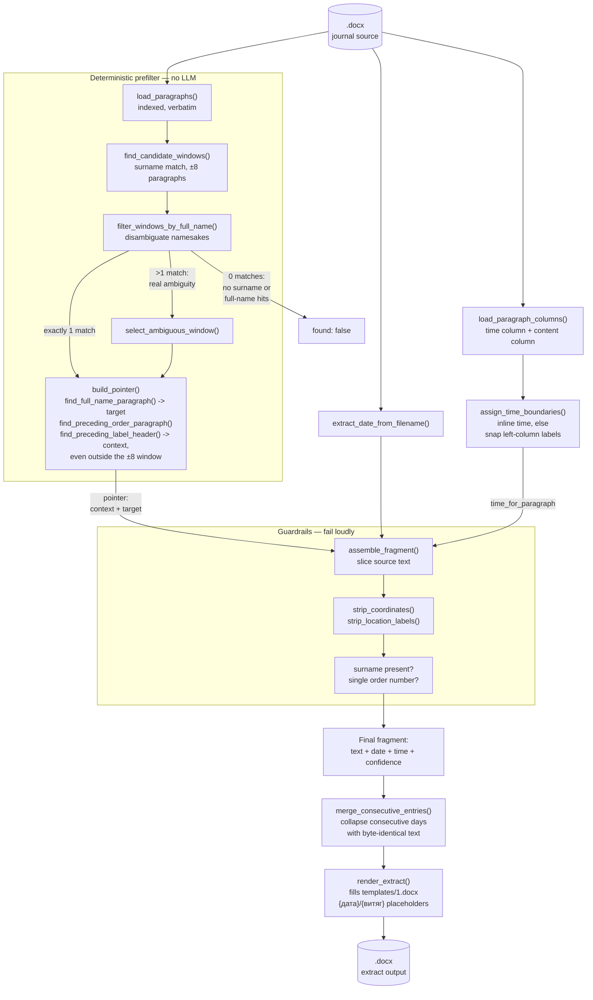

# Journal Extract Generator

A pipeline that generates official `витяг` document from journal
records for a specific serviceman over a date range, sourced from
per-day `.docx` files.
**Everything runs fully local/offline — no cloud calls, no LLM of any kind.**

## Core principle

The output text must be **100% verbatim** from the source journal — zero
paraphrasing, zero rewriting. There is no text-generation model anywhere in
this pipeline: locating a person's mention resolves to *pointers* into a
numbered paragraph list (which paragraphs to include as context, which one
has the target person), computed entirely by deterministic string/regex
logic. All text assembly is deterministic Python code that slices the
original source characters, so there is no channel through which wording
drift could ever be introduced.

The only edits ever applied to the source text are: paragraph selection, a
trailing `;` → `.` fix, and unconditional stripping of MGRS grid
coordinates and "район зосередження" location phrases (tactical data with
no place in a personnel extract). Other people's text sharing the target's
paragraph is left in place, untouched. See `CLAUDE.md` for the full rule
set and rationale.

## Architecture

`load_paragraphs()` parses a day's `.docx` into an indexed, verbatim
paragraph list, which a deterministic surname/full-name prefilter narrows
to the single candidate window containing the person's full name verbatim
— separating namesakes governed by different orders, and (on genuine
ambiguity, i.e. the full name occurring verbatim more than once)
resolved by `select_ambiguous_window()` instead of guessing. `build_pointer()`
(`prefilter.py`) then locates the target paragraph and walks backward for
the governing order and label header, which can sit outside the ±8
window; `assemble_fragment()` slices the source text at that pointer, runs
guardrails, strips coordinates/location labels, applies the one allowed
punctuation fix, and attaches date (`extract_date_from_filename()`) and
time (`assign_time_boundaries()` + `time_for_paragraph()`, inline format
first, left-column heuristic as fallback) metadata — see `CLAUDE.md` for
the bug-log cases and time-extraction caveats behind this logic.
`pipeline.py`'s `resolve_day_fragment()` wraps prefilter → pointer →
assemble into one call per person/day; `merge.py`'s
`merge_consecutive_entries()` then collapses consecutive days with
byte-identical text into a single date-range entry before `render.py`'s
`render_extract()` fills `templates/1.docx`'s placeholders — every value
it writes comes verbatim out of `assemble_fragment()`, so rendering never
introduces a text-generation step.



## Setup

**1. Install Python dependencies**

(Pillow is used only to measure real glyph widths from the bundled
`assets/fonts/Carlito-Regular.ttf`, so `render.py` can compute how many
visual lines a paragraph wraps to and keep the `{дата}` column aligned with
`{витяг}` — see `text_wrap.py`.)

**Linux**

Most current distros (Debian/Ubuntu and derivatives, in particular) ship a
Python that refuses a system-wide `pip install` outside a virtual
environment (PEP 668). `--break-system-packages` overrides that guard:

```bash
pip install python-docx pillow --break-system-packages
```

If your distro doesn't enforce PEP 668, or you'd rather not install into
the system Python at all, a virtual environment works too and needs no
flag:

```bash
python3 -m venv .venv
source .venv/bin/activate
pip install python-docx pillow
```

(Activate the venv — `source .venv/bin/activate` — in every new shell
before running `run.sh`.)

**macOS**

Same PEP 668 guard applies to Homebrew's Python. Either
`pip install python-docx pillow --break-system-packages`, or use a venv as
shown above.

**Windows**

Install Python 3 from [python.org](https://www.python.org/downloads/) (check
"Add python.exe to PATH" during setup), then from PowerShell or Command
Prompt:

```powershell
pip install python-docx pillow
```

`--break-system-packages` is specific to PEP 668-enforcing Python installs
(Linux/macOS above) — omit it on Windows, it isn't recognized there.

**2. Provide source files**

Place daily `.docx` journal files in the `journals/` folder (or point
`JOURNAL_DIR` in `config.py` at a different directory). The scripts pick
up every `.docx` file found there, sorted chronologically by the date
encoded in each filename. Sample extract documents go in `samples/`; the
extract template goes in `templates/` (`TEMPLATE_PATH` in `config.py`).
`journals/` and `samples/` are gitignored — the source and sample content
carries a restricted classification and must never be committed (as is
every `*.docx` file anywhere in the repo, including generated output).

## Running

**Generate a real extract `.docx`** — one file per person, filling
`templates/1.docx` — via `run.sh`, which just forwards its arguments to
`src/generate_extract.py`. Names to extract can be passed either as
inline arguments or as a path to a newline-delimited `.txt` file:

```bash
./run.sh "молодший сержант ПЕТРЕНКО Іван Миколайович"
./run.sh "молодший сержант ПЕТРЕНКО Іван Миколайович" "солдат ШЕВЧЕНКО О.В."
./run.sh ./names.txt
./run.sh "старший солдат БОНДАРЕНКО Олег Васильович 02.04.2026"
./run.sh "старший солдат БОНДАРЕНКО Олег Васильович 02.04.2026-23.04.2026"
```

**Windows**: `run.sh` is a bash script and won't run directly in PowerShell or
Command Prompt. Either run it through Git Bash (bundled with
[Git for Windows](https://git-scm.com/download/win)) or WSL, or call the
Python entry point it wraps directly:

```powershell
python src\generate_extract.py "молодший сержант ПЕТРЕНКО Іван Миколайович"
```

All CLI arguments and behavior are identical either way — `run.sh` only
`cd`s to the repo root and forwards its arguments to
`src/generate_extract.py`.

Each name must be a full `"rank SURNAME Firstname Patronymic"` string
(surname in caps), the same shape `prefilter.py`'s narrowing expects,
optionally followed by a requested `DD.MM.YYYY` date or
`DD.MM.YYYY-DD.MM.YYYY` inclusive range (`person_spec.py`) that limits the
search to those day(s) instead of every file in `journals/`. A `.txt`
file is detected automatically whenever exactly one argument is given and
it's an existing file path — one name (with its own optional date/range)
per line, blank lines skipped. Running `./run.sh` with no arguments
prints a usage message and exits without doing anything; there is no
fallback placeholder-name list anymore, so real names always have to be
supplied explicitly (and never committed — keep any local names file out
of version control yourself).

For each person, the script walks every `.docx` file in `journals/`
chronologically (or just the requested date range, if one was given) via
`resolve_day_fragment()`, collects the days that resolve to `found`,
prints a warning for any day that doesn't (never silently dropped), and —
if at least one day was found — writes
`output/Витяг_<ПРІЗВИЩЕ>_<issue date>.docx` (`OUTPUT_DIR` in `config.py`;
also gitignored). When a date range is requested, any date in it with no
matching `.docx` file is flagged as an explicit gap, distinct from a day
that has a file but doesn't mention the person. The header's issuance
date defaults to today; a stacked entry shows its own date + time when
it's a single unmerged day, or a "з ... по ..." range (no time) when
`merge.py` has collapsed a run of consecutive days with byte-identical
text. An uncertain time renders the same as a confident one — no inline
warning — since inventing a placeholder would violate the verbatim rule;
an entirely unresolved time is simply left out of the rendered text.

Everything here is regex/string logic over an already-parsed paragraph
list, so it runs in well under a second per person/day — no particular
hardware requirements.

## Further reading

`CLAUDE.md` has the full project context: the complete edit-rule list, the
pointer schema, the empirical bug log behind each guardrail and finder
function, known test data/people for regression testing, and what's not
yet built (a tracked accuracy benchmark).
